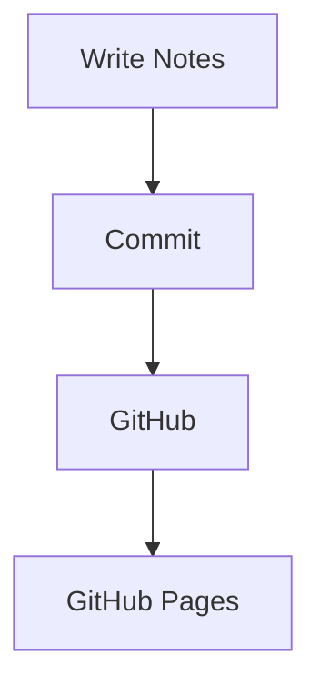

# Introduction
Welcome to my Linux knowledge base.
> This article is updated regularly.
{: .prompt-info }
> Always keep backups before changing your system.
{: .prompt-warning }
> Test everything inside a VM first.
{: .prompt-tip }
> Never blindly copy commands from the Internet.
{: .prompt-danger }
---
## Image

_The generated homepage._
---
## Floating image
{: .right w="350" h="240"}
This paragraph flows around the image.
---
## Shadow
{: .shadow }
---
## Dark / Light images
{: .light }
{: .dark }
---
## Code
```bash
git clone https://github.com/arthas-lich/arthas-lich.github.io
bundle exec jekyll serve
```
---
## File path
`~/.config/alacritty/alacritty.toml`{: .filepath}
---
## Inline code
Run `bundle exec jekyll serve`.
---

## Mathematics
$$
f(x)=x^2+1
$$

Inline equation:

$$x^2+y^2=z^2$$
---
## Mermaid

---
## Table

| Tool | Purpose |
|------|---------|
| Emacs | Writing |
| Git | Version control |
| Chirpy | Blog theme |
| GitHub Pages | Hosting |

---
## Task list
- [x] Install Jekyll
- [x] Configure Chirpy
- [ ] Publish first article
- [ ] Add search
---
## Quote
> Simplicity is prerequisite for reliability.
---
## Footnote
Linux is fun.[^1]
[^1]: Especially when documented well.
