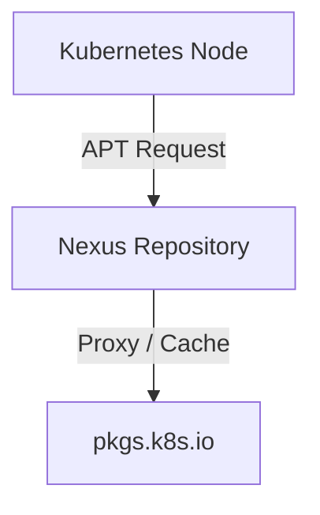

When Kubernetes nodes are running in an environment without direct Internet access, installing or upgrading `kubeadm`, `kubelet`, and `kubectl` requires an internal package repository.

One simple solution is to use **Sonatype Nexus Repository** as an APT proxy for the official Kubernetes package repository.

## 1. Create a Blob Store

First, create a dedicated blob store for the Kubernetes repository.

In Nexus:

**Administration → Repository → Blob Stores → Create Blob Store**

For example:

```text
Name: k8s-apt-v1.36
Type: File
Path: nexus-data/blobs/k8s-apt-v1.36
```

Keeping a separate blob store makes it easier to manage and clean up Kubernetes repository data later.


## 2. Create an APT Proxy Repository

Go to:

**Administration → Repository → Repositories → Create repository**

Select:

```text
apt (proxy)
```


Configure the repository with the following important settings:

```text
Name: k8s-apt-v1.36
Distribution: v1.36
Flat: enabled
Remote storage:
https://pkgs.k8s.io/core:/stable:/v1.36/deb/
```

The important part is the Kubernetes repository URL:

```text
https://pkgs.k8s.io/core:/stable:/v1.36/deb/
```

The `v1.36` distribution and flat-repository configuration should match the structure expected by the Kubernetes package repository.

For the blob store, select:

```text
k8s-apt-v1.36
```

Then save the repository.


## 3. Configure APT on Kubernetes Nodes

On each Kubernetes node, add the Nexus repository instead of accessing `pkgs.k8s.io` directly.

For Ubuntu 24.04, create:

```text
/etc/apt/sources.list.d/k8s-proxy.sources
```
For example:

```bash
cat > /etc/apt/sources.list.d/k8s-proxy.sources <<'EOF'
Types: deb
URIs: https://repo.example.com/repository/k8s-apt-v1.36
Suites: /
Components:
Trusted: yes
EOF
```

Then update the package index:

```bash
apt update
```

You can verify that the Kubernetes packages are available through Nexus:

```bash
apt-cache policy kubeadm kubelet kubectl
```

If your Nexus server uses a trusted internal CA, make sure that CA is installed on the Kubernetes nodes. In that case, you should **not** use `Trusted: yes` as a replacement for proper TLS certificate validation; install the CA certificate and let APT validate the Nexus certificate normally.

## 4. Install Kubernetes Packages

The packages can now be installed normally:

```bash
apt install kubeadm kubelet kubectl
```

The Kubernetes nodes communicate only with the internal Nexus repository:



Once the packages and metadata have been cached, Nexus can serve them to other nodes without every node downloading the same content directly from the Internet.

## Result

With this configuration, Kubernetes nodes can install `kubeadm`, `kubelet`, and `kubectl` from an internal Nexus repository while Nexus handles communication with the official Kubernetes APT repository.

This is especially useful for private or restricted environments where Kubernetes nodes should not have direct Internet access.

> **Note:** You can use the official Kubernetes GPG key instead of `Trusted: yes`:
>
> ```bash
> curl -fsSL https://pkgs.k8s.io/core:/stable:/v1.36/deb/Release.key \
>   | gpg --dearmor -o /etc/apt/keyrings/kubernetes-apt-keyring.gpg
> ```
>
> Then add `Signed-By: /etc/apt/keyrings/kubernetes-apt-keyring.gpg` to your APT source file.
