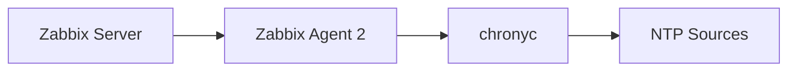

## Overview

I created a small Zabbix template for monitoring **Chrony** on Linux NTP servers.

It uses `chronyc` together with Zabbix Agent 2 to collect basic NTP synchronization information.

The idea is simple:



## What it monitors

The template monitors:

- Chrony service status
- Stratum
- Clock offset
- Number of NTP sources
- NTP source synchronization status

## Installation

Install the Zabbix Agent 2 configuration:

```bash
sudo mkdir -p /etc/zabbix/zabbix_agent2.d

sudo curl -fsSL \
  https://raw.githubusercontent.com/arman-chahardoli/zabbix-chrony-template/main/zabbix_agent2.d/chrony_service.conf \
  -o /etc/zabbix/zabbix_agent2.d/chrony_service.conf
```

Install the required scripts:

```bash
sudo curl -fsSL \
  https://raw.githubusercontent.com/arman-chahardoli/zabbix-chrony-template/main/scripts/chrony_global_status \
  -o /usr/local/bin/chrony_global_status

sudo curl -fsSL \
  https://raw.githubusercontent.com/arman-chahardoli/zabbix-chrony-template/main/scripts/chrony_global_sources_status \
  -o /usr/local/bin/chrony_global_sources_status

sudo chmod +x /usr/local/bin/chrony_global_*
```

Restart Zabbix Agent 2:

```bash
sudo systemctl restart zabbix-agent2
```

Then import:

```text
zabbix_template/chrony_service_template.yaml
```

into Zabbix and link the template to the required Linux hosts.

### [Github: zabbix-chrony-template](https://github.com/arman-chahardoli/zabbix-chrony-template)
---
