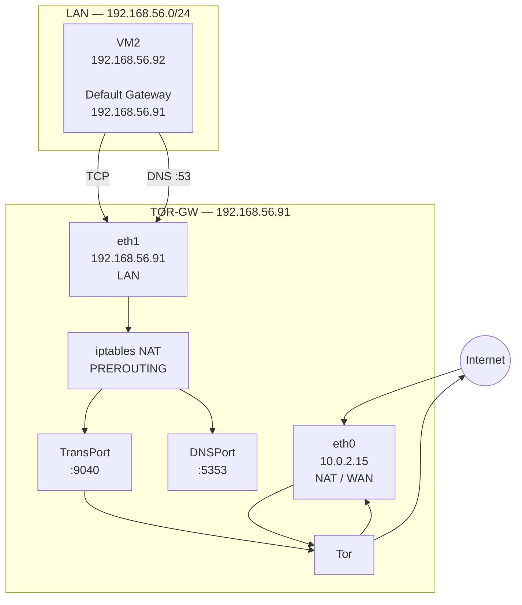

# A small lab for experimenting with a transparent Tor gateway using two Ubuntu virtual machines.

The idea is simple:



VM2 does not need to run Tor itself. Its default gateway is the Tor gateway, which transparently redirects TCP and DNS traffic into Tor.

## Lab environment

The lab uses two Ubuntu 24.04 VMs created with Vagrant and VirtualBox.

```text
vm1 / TOR-GW
  eth0: 10.0.2.15
  eth1: 192.168.56.91

vm2
  eth0: 10.0.2.15
  eth1: 192.168.56.92
```

The Vagrant configuration is intentionally small:

```ruby
Vagrant.configure("2") do |config|

  config.vm.box = "bento/ubuntu-24.04"

  config.vm.define "vm1" do |vm|
    vm.vm.hostname = "vm1"
    vm.vm.network "private_network", ip: "192.168.56.91"

    vm.vm.provider "virtualbox" do |vb|
      vb.name = "vm1"
      vb.memory = 1024
      vb.cpus = 1
    end
  end

  config.vm.define "vm2" do |vm|
    vm.vm.hostname = "vm2"
    vm.vm.network "private_network", ip: "192.168.56.92"

    vm.vm.provider "virtualbox" do |vb|
      vb.name = "vm2"
      vb.memory = 1024
      vb.cpus = 1
    end
  end

end
```

Starting the environment:

```bash
vagrant up
```

Both machines booted successfully with Ubuntu 24.04.2 LTS. Vagrant configured the NAT interface as `eth0` and the private network as `eth1`.

## Configure the Tor gateway

On VM1, change the hostname:

```bash
hostnamectl set-hostname TOR-GW
```

Install Tor, Nyx and the required networking packages:

```bash
apt update
apt install tor nyx
apt install iptables-persistent
```

`iptables-persistent` also installs `netfilter-persistent`.

The package installation removed UFW in this lab because of the package dependency/configuration.

## Tor configuration

Edit:

```bash
vim /etc/tor/torrc
```

The relevant configuration used in the lab:

```conf
RunAsDaemon 1

VirtualAddrNetworkIPv4 10.192.0.0/10
AutomapHostsOnResolve 1

TransPort 0.0.0.0:9040
DNSPort 0.0.0.0:5353

SocksPort 0.0.0.0:9050
SocksPolicy accept *
ControlPort 9051
```

Restart Tor:

```bash
systemctl restart tor
```

On Ubuntu, `tor.service` is a multi-instance master service, so seeing:

```text
Active: active (exited)
```

does not by itself mean that Tor failed.

Nyx can also be used to inspect the Tor process:

```bash
nyx
```

## Configure iptables

The gateway has:

```bash
WAN=eth0
LAN=eth1
TOR_VM_IP=192.168.56.91
```

First clear the NAT table:

```bash
iptables -t nat -F
```

Do not redirect Tor's own traffic back into Tor:

```bash
iptables -t nat -A OUTPUT \
  -m owner --uid-owner debian-tor \
  -j RETURN
```

Avoid redirecting loopback traffic:

```bash
iptables -t nat -A OUTPUT \
  -d 127.0.0.0/8 \
  -j RETURN
```

Avoid redirecting Tor's virtual address network:

```bash
iptables -t nat -A OUTPUT \
  -d 10.192.0.0/10 \
  -j RETURN
```

Enable NAT toward the WAN interface:

```bash
iptables -t nat -A POSTROUTING \
  -o $WAN \
  -j MASQUERADE
```

Allow SSH from the LAN to the gateway without transparent redirection:

```bash
iptables -t nat -A PREROUTING \
  -i $LAN \
  -p tcp --dport 22 \
  -j RETURN
```

Likewise, don't redirect traffic addressed directly to the gateway:

```bash
iptables -t nat -A PREROUTING \
  -i $LAN \
  -d $TOR_VM_IP \
  -j RETURN
```

Redirect DNS:

```bash
iptables -t nat -A PREROUTING \
  -i $LAN \
  -p udp --dport 53 \
  -j REDIRECT --to-ports 5353

iptables -t nat -A PREROUTING \
  -i $LAN \
  -p tcp --dport 53 \
  -j REDIRECT --to-ports 5353
```

Finally, transparently redirect new TCP connections to Tor's `TransPort`:

```bash
iptables -t nat -A PREROUTING \
  -i $LAN \
  -p tcp \
  -m conntrack --ctstate NEW \
  -j REDIRECT --to-ports 9040
```

The resulting NAT rules can be inspected with:

```bash
iptables-save
```

The lab produced the expected `PREROUTING`, `OUTPUT`, and `POSTROUTING` rules, including the TCP redirect to port `9040` and DNS redirects to `5353`.

## Persist the rules

Because `iptables-persistent` is installed, save the current rules:

```bash
iptables-save > /etc/iptables/rules.v4
```

This allows the rules to be restored after reboot.

```bash
systemctl restart netfilter-persistent
```

## Configure VM2

VM2 initially has the normal Vagrant NAT default route:

```text
default via 10.0.2.2 dev eth0
```

The private interface is:

```text
192.168.56.92/24
```

The important part is changing VM2's default gateway to the Tor gateway:

```bash
ip route del default via 10.0.2.2 dev eth0

ip route add default via 192.168.56.91 dev eth1
```

The resulting routing table contains:

```text
default via 192.168.56.91 dev eth1
192.168.56.0/24 dev eth1
```

while the original NAT interface remains available for the directly connected `10.0.2.0/24` network.

## Testing the gateway

With VM2 using `192.168.56.91` as its default gateway, test an external connection:

```bash
curl https://check.torproject.org/api/ip
```

The first attempts failed while routing/DNS configuration was still being adjusted.

After changing the default route to the Tor gateway:

```bash
ip route del default via 192.168.56.11 dev eth1
ip route add default via 192.168.56.91 dev eth1
```

the test succeeded:

```json
{
  "IsTor": true,
  "IP": "192.42.116.68"
}
```

This is the important result of the lab: VM2's request was recognized by the Tor Project as originating through the Tor network.

For easier output:

```bash
curl https://check.torproject.org/api/ip | jq
```

Result:

```json
{
  "IsTor": true,
  "IP": "192.42.116.68"
}
```

## Final topology

At the end, the traffic path looks like:

```text
VM2
192.168.56.92
    |
    | default gateway
    v
TOR-GW
192.168.56.91
    |
    | iptables REDIRECT
    v
Tor TransPort :9040
    |
    v
Tor network
    |
    v
Internet
```

DNS follows a similar path:

```text
VM2 :53
   |
   v
TOR-GW
   |
   | REDIRECT
   v
Tor DNSPort :5353
   |
   v
Tor network
```

## What this lab demonstrates

This setup demonstrates how a Linux machine can act as a transparent Tor gateway for another machine.

The client VM does not need to know that Tor is being used. Its normal TCP connections are redirected by the gateway's NAT rules to Tor's transparent proxy port.

The key components are:

- **Vagrant** — creates the reproducible two-VM lab.
- **Ubuntu 24.04** — operating system for both nodes.
- **Tor** — provides the anonymizing network.
- **iptables** — transparently redirects client traffic.
- **iptables-persistent** — persists the firewall/NAT configuration.
- **Nyx** — provides a terminal interface for monitoring Tor.
- **VM2 default route** — sends client traffic through the Tor gateway.

The final `check.torproject.org` test confirmed that the traffic from VM2 was passing through Tor.

> **Note:** This is a lab configuration for understanding transparent proxying and Tor networking. A production gateway would require considerably more attention to firewall policy, IPv6 handling, UDP behavior, DNS leaks, routing persistence, client isolation, and failure handling.
